🧠 Psico —  App de salud mental en Android
Aplicación desarrollada en Java usando Android Studio, pensada para apoyar a personas que enfrentan estrés, depresión, falta de confianza, motivación o autoestima. Su objetivo es ofrecer herramientas y rutinas para fortalecer el bienestar emocional.

📱 Requisitos
Android 8.0 o superior

🎯 Módulos principales 
Además del sistema de autenticación (login), la app ofrece 4 apartados funcionales:

🏠 Home

🧩 Hábitos

🧘 Relajación

📓 Diario emocional

🛠️ Tecnologías utilizadas 
📐 Android Studio

☕ Java

🎨 Diseño con layouts interactivos

📸 Vista previa de la app 
🔐 Autenticación

 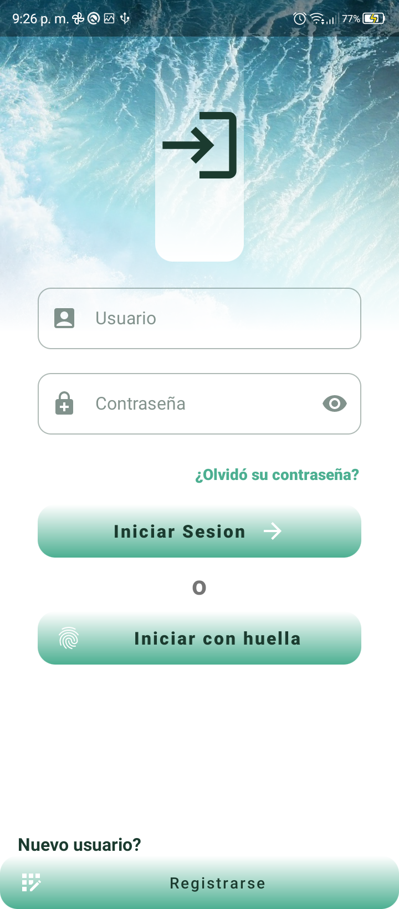 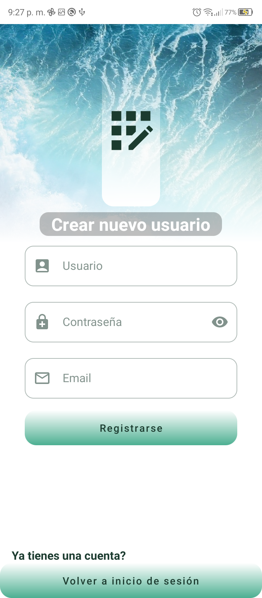 

🏠 Home y configuración

 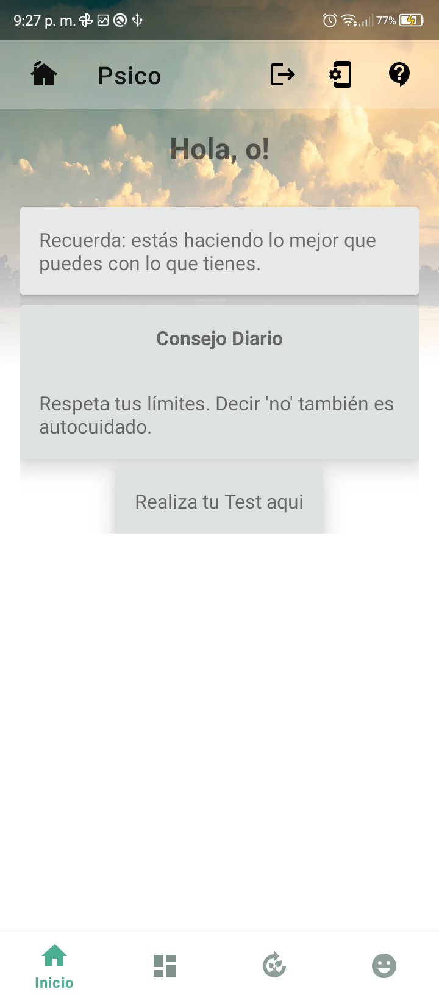 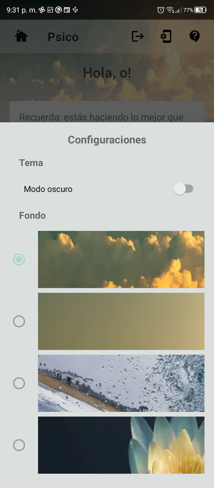 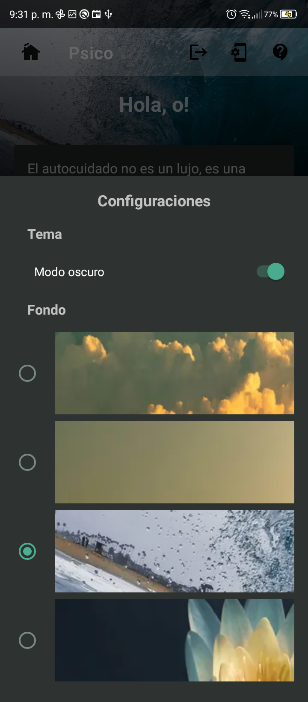 

🧩 Hábitos personales

 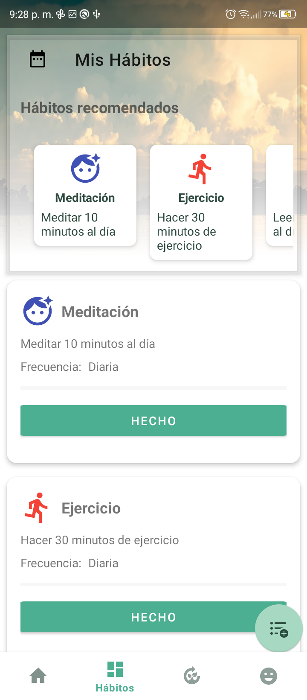 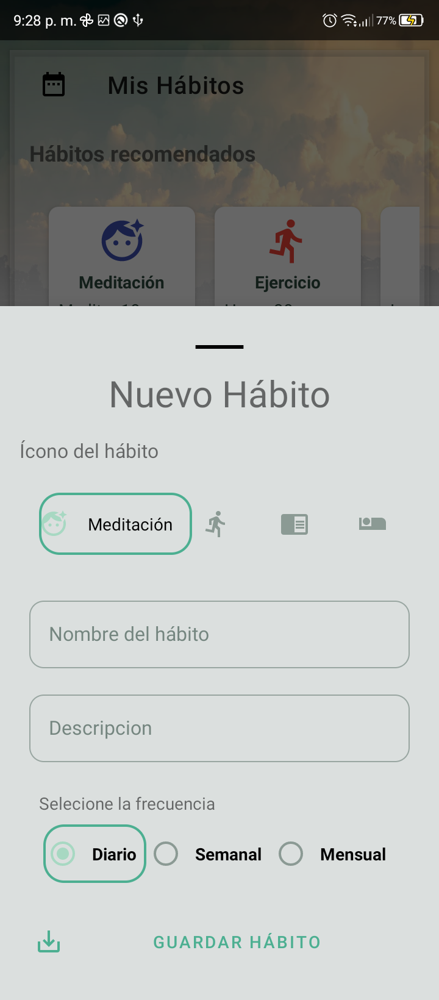 

🧘 Herramientas de relajación

 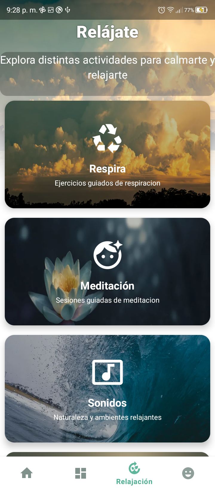 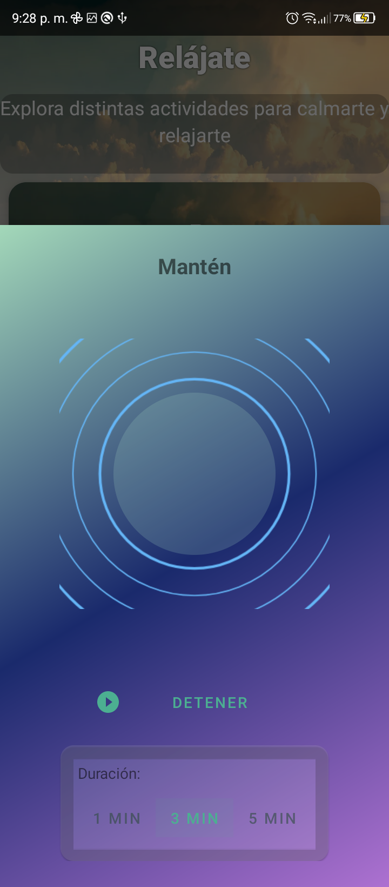 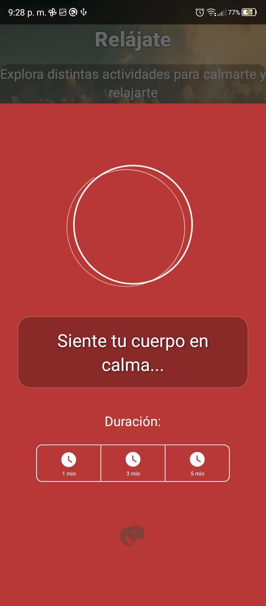 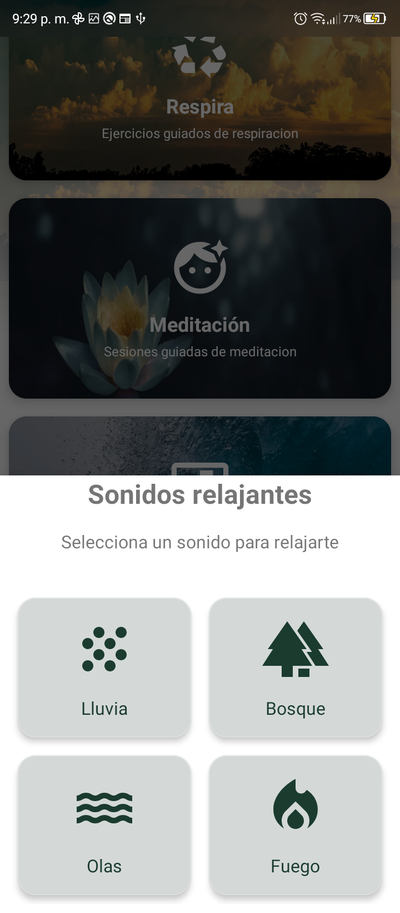 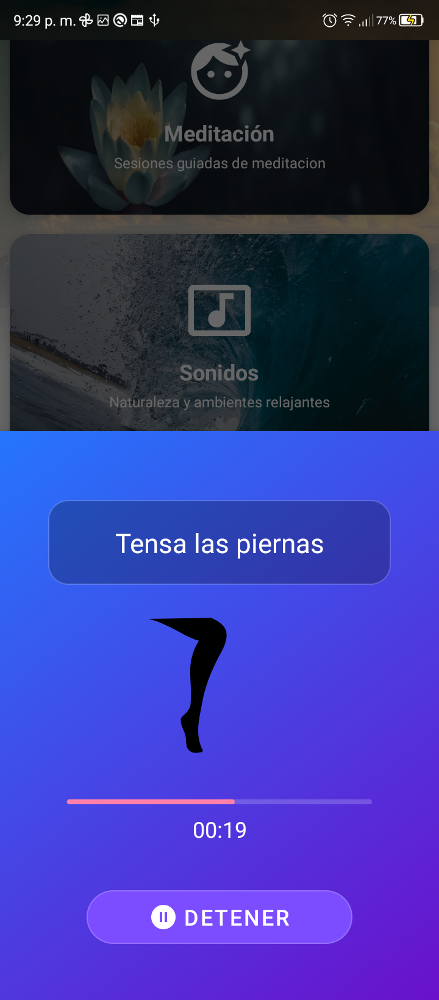 

📓 Diario emocional

 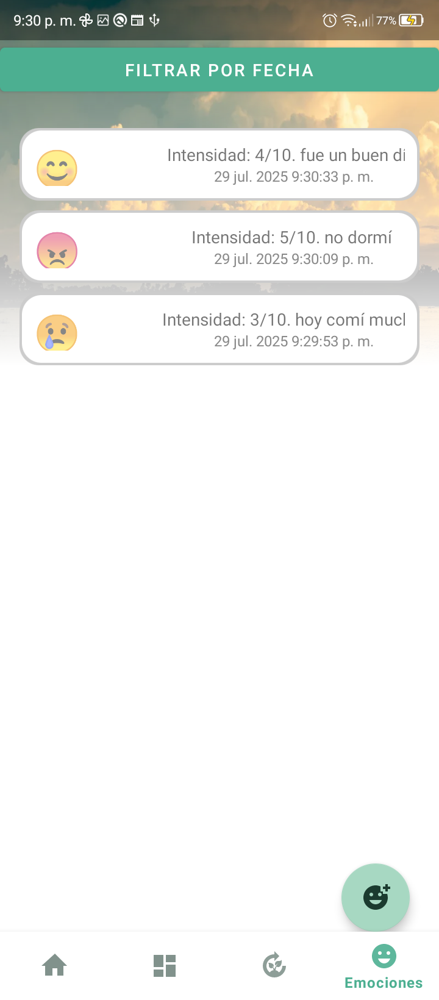 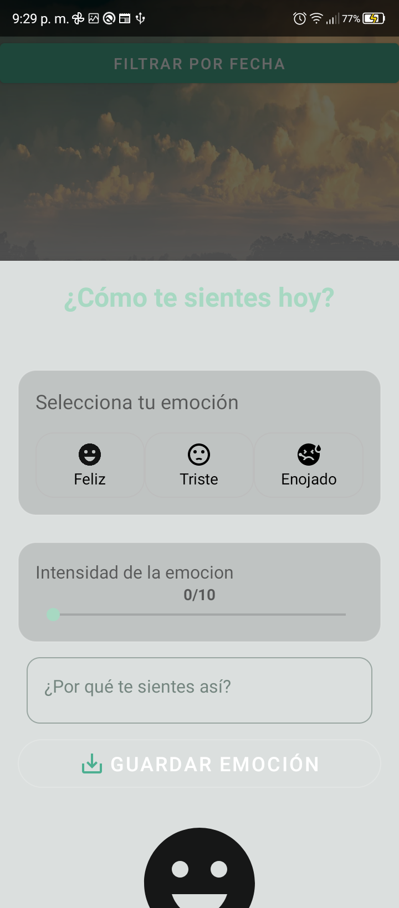 

👤 Autor
@Ahjin-arch
